# 📘 統合仕様書 v1.3
## Grimoire Guardians - 教育ゲームアプリ 完全仕様

## 🎯 このドキュメントの目的

Grimoire Guardiansプロジェクトの**全体仕様を統合的に記述**し、開発者（AI・人間）が実装時に参照する唯一の真実（Single Source of Truth）とする。

### 対象読者
1. **Claude Code（Web版）** - 実装時の参照
2. **開発者（人間）** - プロジェクト全体の理解
3. **レビュアー** - 仕様の妥当性確認

### 成功基準
1. このドキュメントだけでPhase 0が実装できる
2. Deep Research結果を容易に取り込める
3. 将来の拡張（DLC、新機能）に対応できる

---

## 📚 目次

1. [プロジェクト概要](#1-プロジェクト概要)
2. [Phase 0 スコープ定義](#2-phase-0-スコープ定義)
3. [データ構造設計](#3-データ構造設計)
4. [画面遷移フロー](#4-画面遷移フロー)
5. [販売モデル設計](#5-販売モデル設計)
6. [コンテンツ拡張設計](#6-コンテンツ拡張設計)
7. [セーブデータ互換性](#7-セーブデータ互換性)
8. [技術スタック](#8-技術スタック)
   - [8-4. デプロイ戦略（公開・本番移行計画）](#8-4-デプロイ戦略公開本番移行計画)
   - [8-5. アセット管理方針（スプライトシート移行基準）](#8-5-アセット管理方針スプライトシート移行基準)
9. [開発ロードマップ（概要）](#9-開発ロードマップ概要)
10. [イベント・演出システム詳細](#10-イベント演出システム詳細)
11. [素材・ドロップシステム詳細](#11-素材ドロップシステム詳細)
12. [P0自己QA](#12-p0自己qa)

---

## 1. プロジェクト概要

### 1-1. プロジェクト名
**Grimoire Guardians（グリモア・ガーディアンズ）**  
魔導書の守護者

### 1-2. コンセプト
小学生が**楽しく勉強できる**教育ゲームアプリ。  
RPG風の世界観で、問題を解くことで敵を倒し、物語を進める。

### 1-3. ターゲットユーザー
- **主要**: 小学1年生〜6年生（6歳〜12歳）
- **副次**: 保護者（学習進捗の確認）
- **環境**: タブレット端末（横向き専用）

### 1-4. 教育目標
- 計算力の向上（Phase 0: 算数）
- 学習習慣の定着
- 達成感と自己肯定感の向上

### 1-5. ビジネスモデル
- **本体**: 売り切り型（価格は品質に応じて後決定）
- **DLC**: 追加コンテンツ（科目・学年ごと）
- **配信**: PWA（ブラウザ版）、将来的にアプリストア対応

---

## 2. Phase 0 スコープ定義

### 2-1. Phase 0の目的
MVP（Minimum Viable Product）として、**最小限の機能で動作するアプリ**を作成。  
以下の検証を行う:
1. 技術的実現可能性（PWA、Pure JS）
2. ユーザー体験（楽しさ、わかりやすさ）
3. 販売モデルの妥当性

### 2-2. Phase 0 に含まれる機能

#### 対象範囲
- **教科**: 算数のみ
- **学年**: 1年生のみ
- **問題タイプ**: 計算問題、筆記問題（v1.1追加）
- **単元数**: **固定しない**（Deep Research結果に基づいて動的に決定）

#### 実装する画面
1. **本棚画面** - ワールド選択
2. **問題画面** - 問題表示、回答、判定
3. **結果画面** - スコア表示、統計
4. **クリア演出画面** - ワールドクリア時

#### 実装する機能
- セーブ/ロード（IndexedDB）
- 進捗管理
- スコア計算
- クリア演出（斬撃エフェクト、撃破エフェクト）
- 横向き固定
- タッチリップル
- **筆記問題（基本UI）** ← v1.1追加（Phase 1から前倒し）
- **イベントシステム** ← v1.1追加
- **素材ドロップシステム** ← v1.1追加

#### モック実装（Phase 1で実装）
- サウンド（SoundManager: ログ出力のみ）
- 振動（HapticFeedback: ログ出力のみ）

### 2-3. Phase 0 に含まれない機能

#### 問題タイプ
- 図形問題
- 画像問題
- ~~筆記問題~~ ← v1.1でPhase 0に移動

#### 機能
- きおくのいせき（復習機能）
- スキンシステム
- 家ビルド
- ~~マルチプレイ~~ ← v1.1で完全削除
- ランキング

#### 教科・学年
- 算数2年生以降
- 国語、理科、社会、英語

---

## 3. データ構造設計

### 3-1. 単元マッピングシステム（最重要）

#### 3-1-1. 設計思想

```
問題: ワールド数を事前に固定できない

理由:
- 小学1年生の算数単元数が不明
- Deep Researchで単元別情報を後で取得
- 文部科学省の学習指導要領に準拠

解決策: 単元マッピングシステム
- 単元情報を動的に管理
- Deep Research結果を取り込める構造
- ワールド数は単元数に応じて自動決定
```

#### 3-1-2. 単元マッピングデータ構造

```javascript
// src/data/curriculum/math-grade1-mapping.js
// @ts-check

/**
 * 算数1年生の単元マッピング
 * Deep Research結果を元に作成（後で更新）
 * 
 * @typedef {Object} UnitMapping
 * @property {string} id - 単元ID
 * @property {string} name - 単元名
 * @property {number} order - 学習順序
 * @property {string} category - カテゴリ
 * @property {number} difficulty - 難易度（1-5）
 * @property {string[]} prerequisites - 前提単元
 * @property {number} estimatedQuestions - 想定問題数
 */

export const mathGrade1Mapping = {
  meta: {
    subject: 'math',
    grade: 1,
    source: 'Deep Research（文部科学省学習指導要領）',
    lastUpdated: '2026-02-15',
    version: '1.0'
  },
  
  units: [
    {
      id: 'unit_001',
      name: '10までのかず',
      order: 1,
      category: 'number',
      difficulty: 1,
      prerequisites: [],
      estimatedQuestions: 5,
      description: '1から10までの数を理解し、数える'
    },
    {
      id: 'unit_002',
      name: 'たしざん（1けた）',
      order: 2,
      category: 'calculation',
      difficulty: 2,
      prerequisites: ['unit_001'],
      estimatedQuestions: 10,
      description: '1桁の足し算（繰り上がりなし）'
    },
    {
      id: 'unit_003',
      name: 'ひきざん（1けた）',
      order: 3,
      category: 'calculation',
      difficulty: 2,
      prerequisites: ['unit_001'],
      estimatedQuestions: 10,
      description: '1桁の引き算（繰り下がりなし）'
    },
    // ... Deep Research後に追加
    // 実績: 16単元（ロードマップv1.4参照）
  ],
  
  // 単元をワールドにマッピング
  worldMapping: {
    strategy: 'one-unit-per-world',  // 1単元 = 1ワールド
    // または 'grouped-units'  // 関連単元をグループ化
  }
};

/**
 * 単元からワールドを生成
 */
export function generateWorlds(mapping) {
  return mapping.units.map((unit, index) => ({
    id: `world_${index + 1}`,
    unitId: unit.id,
    title: unit.name,
    description: unit.description,
    difficulty: unit.difficulty,
    questionsCount: unit.estimatedQuestions,
    icon: getIconForCategory(unit.category),
    locked: index > 0  // 最初のワールド以外はロック
  }));
}

function getIconForCategory(category) {
  const icons = {
    'number': '🔢',
    'calculation': '➕',
    'shape': '🔷',
    'measurement': '📏',
    'graph': '📊'
  };
  return icons[category] || '📘';
}
```

#### 3-1-3. Deep Research結果の取り込みフロー

```mermaid
graph TD
    A[Deep Research実施] --> B[単元別情報取得]
    B --> C[単元マッピング作成]
    C --> D[math-grade1-mapping.js更新]
    D --> E[ワールド自動生成]
    E --> F[問題データ作成]
    F --> G[Phase 0実装完了]
```



### 3-2. 問題データ構造

```javascript
// src/data/questions/math-grade1.js
// @ts-check

/**
 * 問題データ構造
 * 
 * @typedef {Object} Question
 * @property {string} id - 問題ID
 * @property {string} unitId - 単元ID（単元マッピングと紐付け）
 * @property {string} type - 問題タイプ
 * @property {Object} content - 問題内容（タイプごとに異なる）
 * @property {number[]} choices - 選択肢
 * @property {number} correctAnswer - 正解
 * @property {number} difficulty - 難易度（1-5）
 */

export const questions = [
  {
    id: 'q_math_g1_u001_001',
    unitId: 'unit_001',  // '10までのかず'
    type: 'calculation',
    content: {
      operand1: 3,
      operator: '+',
      operand2: 2
    },
    choices: [4, 5, 6, 7],
    correctAnswer: 5,
    difficulty: 1
  },
  {
    id: 'q_math_g1_u002_001',
    unitId: 'unit_002',  // 'たしざん（1けた）'
    type: 'calculation',
    content: {
      operand1: 4,
      operator: '+',
      operand2: 5
    },
    choices: [7, 8, 9, 10],
    correctAnswer: 9,
    difficulty: 2
  },
  // ... 単元ごとに問題を追加
];

/**
 * 問題データの拡張性
 * Phase 0: 計算問題、筆記問題
 * Phase 1以降の問題タイプに対応
 */
const questionTypeExamples = {
  // Phase 0: 計算問題
  calculation: {
    operand1: 3,
    operator: '+',
    operand2: 5
  },
  
  // Phase 0: 筆記問題（v1.2仕様確定）
  handwriting: {
    targetNumber: 8,
    question: '8を かいて みよう',
    validationMethod: 'simple_shape_matching',  // 簡易的な形状マッチング
    tolerance: 0.8  // 80%の精度でOK（寛容な判定）
  },
  
  // Phase 1: 図形問題
  shape: {
    shapeType: 'triangle',
    question: 'この形の名前は？',
    imageUrl: './assets/shapes/triangle.svg'
  },
  
  // Phase 1: 画像問題
  image: {
    imageUrl: './assets/images/apples.png',
    question: 'りんごはいくつありますか？'
  }
};
```

### 3-3. セーブデータ構造

```javascript
// セーブデータ構造（IndexedDB）
const saveDataSchema = {
  version: '1.0.0',
  
  // コアデータ（Phase 0）
  core: {
    player: {
      name: 'プレイヤー',
      createdAt: '2026-02-15T12:00:00Z',
      lastPlayedAt: '2026-02-15T14:30:00Z'
    },
    
    progress: {
      subject: 'math',
      grade: 1,
      
      // ワールドごとの進捗
      worlds: {
        'world_1': {
          unitId: 'unit_001',
          cleared: true,
          score: 5,
          maxScore: 5,
          attempts: 1,
          clearedAt: '2026-02-15T13:00:00Z'
        },
        'world_2': {
          unitId: 'unit_002',
          cleared: false,
          score: 3,
          maxScore: 10,
          attempts: 2,
          clearedAt: null
        }
        // ... 動的に追加
      },
      
      // 統計情報
      stats: {
        totalQuestions: 50,
        correctAnswers: 45,
        accuracy: 0.9,
        totalPlayTime: 3600  // 秒
      }
    },

    // クイズセッション（メモリのみ・保存不要）
    currentSession: {
      worldId: null,
      unitId: null,
      questions: [],
      answers: [],
      rewardMultiplier: 1.0,
      shieldActive: false,
      streak: 0,        // ← v1.3追加: 現在の連続正解数（セッション開始時リセット）
      maxStreak: 0      // ← v1.3追加: セッション中の最大連続正解数（ResultScreenで表示用）
    },
    
    // インベントリ（v1.1追加）
    inventory: {
      materials: {
        wood: 23,
        stone: 15,
        brick: 5,
        gem: 2,
        star_fragment: 1
      }
    }
  },
  
  // DLCデータ（Phase 1以降）
  dlc: {
    installed: [],  // ['math-grade2', 'japanese-grade1']
    data: {}
  }
};
```

### 3-4. ライセンスデータ構造

```javascript
// ライセンス管理
const licenseSchema = {
  // 本体ライセンス
  core: {
    licensed: false,
    licenseKey: '',
    activatedAt: null,
    expiresAt: null  // 売り切りなのでnull
  },
  
  // DLCライセンス
  dlc: {
    'math-grade2': {
      licensed: false,
      licenseKey: '',
      activatedAt: null
    },
    'japanese-grade1': {
      licensed: false,
      licenseKey: '',
      activatedAt: null
    }
    // ... 追加DLC
  }
};
```

---

## 4. 画面遷移フロー

### 4-1. 画面遷移図

```mermaid
stateDiagram-v2
    [*] --> 起動画面
    起動画面 --> 本棚画面: ロード完了
    
    本棚画面 --> 問題画面: ワールド選択
    問題画面 --> イベント画面: イベント発生
    イベント画面 --> 問題画面: イベント完了
    問題画面 --> 結果画面: 全問回答
    結果画面 --> クリア演出: クリア条件達成
    結果画面 --> 本棚画面: クリア条件未達成
    クリア演出 --> 本棚画面: 演出終了
    
    本棚画面 --> ライセンス入力: ロックワールドタップ
    ライセンス入力 --> 本棚画面: 認証成功/キャンセル
    
    本棚画面 --> インベントリ画面: もちものタップ
    インベントリ画面 --> 本棚画面: 戻る
```



### 4-2. 各画面の詳細

#### 起動画面
- **目的**: リソース読み込み、初期化
- **表示時間**: 3秒以内
- **処理**:
  1. IndexedDB初期化
  2. セーブデータ読み込み
  3. 単元マッピング読み込み
  4. ワールド生成

#### 本棚画面
- **目的**: ワールド選択
- **表示内容**:
  - ワールドカード（動的生成）
  - 進捗表示（%）
  - ロック/アンロック表示
  - 「もちもの」ボタン（v1.1追加）
- **操作**:
  - ワールドタップ → 問題画面
  - ロックワールドタップ → ライセンス入力
  - もちものタップ → インベントリ画面

#### 問題画面
- **目的**: 問題を解く
- **表示内容**:
  - 問題文（3 + 5 = ?）
  - 選択肢（4つ）または手書き入力エリア
  - 進捗表示（1/5問目）
  - タイマー（オプション）
  - 報酬倍率アイコン（v1.1追加）
- **操作**:
  - 選択肢タップ → 正解/不正解判定 → 次の問題
  - 筆記問題: 手書き入力 → 認識 → 判定
  - イベント発生時 → イベント画面へ遷移
  - 全問回答 → 結果画面

#### イベント画面（v1.1追加）
- **目的**: イベント実行（おみくじ、3択の道、モンスターバトル、宝箱）
- **詳細**: セクション10参照

#### 結果画面（v1.3詳細化・ClearScreen統合）
- **目的**: スコア表示、クリア判定、達成演出
- **クリア条件**: 60%以上正解
- **表示モード**: `mode: 'clear' | 'perfect' | 'fail'` で内部切り替え
  - ※旧「クリア演出画面（ClearScreen）」をこの画面に統合

##### 🌟 クリア時（60%以上）
- **星評価**:
  - ⭐      60〜79%
  - ⭐⭐    80〜89%
  - ⭐⭐⭐  90〜100%
- **演出**:
  1. 星がひとつずつ飛び込んでくる（bounce-in）
  2. スター数カウントアップアニメーション
  3. 報酬倍率（おみくじバフ）適用演出（倍率あり時のみ）
  4. 獲得素材カードめくり演出（1枚ずつ順に表示）
  5. セーブデータ更新（cleared: true、次ワールド解放）
- **ボタン**: 「もう一いかい」「本棚へ」

##### 🌸 未クリア時（60%未満）— がんばったで賞
- **花丸演出**（SVG stroke-dashoffset によるペン書き風）:
  1. `0.0s` 画面に暖かいピンクのオーバーレイ
  2. `0.1s` 大きな花丸がゆっくり描かれる（0.8秒、太い手書き線）
  3. `0.9s` 円が閉じた瞬間に ✨ 8方向バースト
  4. `1.0s` 「はなまる！」スタンプ（中央、-15deg、scale bounce）
  5. `1.2s` 🌸🌟💫 シャワー（JS生成20個、2秒間ふわふわ落下）
  6. `1.8s` 「よく がんばったね！」スライドイン
  7. `2.0s` 「まえより ○もん ふえたよ！」（記録比較、初回は非表示）
  8. `2.5s` ボタン出現
- **ボタン**: 「もう一いかい！」「本棚へ」

#### インベントリ画面（v1.1追加）
- **目的**: 素材確認
- **表示内容**:
  - タブ1: 家ビルド素材
  - タブ2: スキン素材
  - タブ3: 特殊素材（Phase 1）
- **Phase 0機能**: 閲覧のみ
- **Phase 1機能**: 素材使用

---

## 5. 販売モデル設計

### 5-1. 販売戦略

#### 基本方針
- **売り切り型**: 一度購入すれば永続利用可能
- **DLC方式**: 科目・学年ごとに追加購入
- **体験版**: Phase 0の一部を無料で遊べる

#### 価格設定方針
```
価格は品質に応じて後決定

考慮要素:
1. コンテンツ量（単元数、問題数）
2. 開発コスト
3. 競合アプリの価格
4. ターゲット層の購買力

想定価格帯:
- 本体: 300円〜1,000円
- DLC: 100円〜300円/科目・学年
```

### 5-2. ライセンスモデル

#### 5-2-1. ライセンスキー方式

```
PWAでの販売方法:

1. 外部決済サイトで購入
   - Stripe, PayPal等
   
2. 購入完了後、ライセンスキーを発行
   - メール送信
   
3. アプリ内でライセンスキーを入力
   - 本棚画面の「ライセンス入力」ボタン
   
4. サーバーで検証
   - https://api.grimoire-guardians.com/validate
   
5. 検証成功でコンテンツ解放
   - localStorageに保存
   - ワールド解放
```

#### 5-2-2. ライセンスキー生成ルール

```javascript
// ライセンスキー形式
// GG-[タイプ]-[ランダム16桁]-[チェックサム4桁]

例:
GG-CORE-A3F9D8C2E1B4F7A8-9C2E  // 本体
GG-DLC2-B4E8F9A1C3D5E7F9-1A3B  // 算数2年生
GG-DLCJ-C5F9A2D4E6F8A0B2-2B4C  // 国語1年生

タイプコード:
- CORE: 本体（算数1年生）
- DLC2: 算数2年生
- DLC3: 算数3年生
- DLCJ: 国語1年生
- DLCS: 理科1年生
```

#### 5-2-3. ライセンス検証フロー

```mermaid
sequenceDiagram
    participant User
    participant App
    participant Server
    participant DB
    
    User->>App: ライセンスキー入力
    App->>App: フォーマット検証
    App->>Server: 検証リクエスト
    Server->>DB: キーの有効性確認
    DB->>Server: 結果返却
    Server->>App: 検証結果
    App->>App: localStorage保存
    App->>User: コンテンツ解放
```



### 5-3. 体験版設計

```javascript
// 体験版の制限
const freeTrialLimits = {
  // 最初の3ワールドまで無料
  freeWorlds: 3,
  
  // それ以降はライセンス必要
  requiresLicense: (worldIndex) => worldIndex >= 3,
  
  // セーブデータは保持
  savePersists: true,
  
  // 広告なし（重要）
  noAds: true
};

// 実装
class LicenseManager {
  static canAccessWorld(worldId) {
    const worldIndex = parseInt(worldId.split('_')[1]) - 1;
    
    // 無料範囲内
    if (worldIndex < freeTrialLimits.freeWorlds) {
      return true;
    }
    
    // ライセンスチェック
    const license = this.getLicense();
    return license.core.licensed;
  }
  
  static getLicense() {
    const stored = localStorage.getItem('license');
    return stored ? JSON.parse(stored) : defaultLicense;
  }
}
```

### 5-4. 販売モデルの技術実装詳細（v1.1追加）

#### 5-4-1. ライセンス管理システム

```javascript
// src/core/LicenseManager.js
class LicenseManager {
  static LICENSE_STORAGE_KEY = 'grimoire_license';
  static API_ENDPOINT = 'https://api.grimoire-guardians.com/validate';
  
  // ライセンスキー検証
  static async validateLicenseKey(key) {
    // 1. フォーマット検証
    if (!this.isValidFormat(key)) {
      return { valid: false, error: 'Invalid format' };
    }
    
    // 2. サーバー検証
    try {
      const response = await fetch(this.API_ENDPOINT, {
        method: 'POST',
        headers: { 'Content-Type': 'application/json' },
        body: JSON.stringify({ key })
      });
      
      const result = await response.json();
      
      if (result.valid) {
        // 3. ローカルストレージに保存
        this.saveLicense(result.licenseData);
        
        // 4. コンテンツ解放
        this.unlockContent(result.contentType);
        
        return { valid: true, contentType: result.contentType };
      }
      
      return { valid: false, error: result.error };
      
    } catch (error) {
      Logger.error('License validation failed:', error);
      return { valid: false, error: 'Network error' };
    }
  }
  
  // フォーマット検証
  static isValidFormat(key) {
    // GG-[TYPE]-[16桁]-[4桁]
    const pattern = /^GG-[A-Z0-9]{4}-[A-F0-9]{16}-[A-F0-9]{4}$/;
    return pattern.test(key);
  }
  
  // ライセンス保存
  static saveLicense(licenseData) {
    const current = this.getLicense();
    
    if (licenseData.type === 'CORE') {
      current.core = {
        licensed: true,
        licenseKey: licenseData.key,
        activatedAt: new Date().toISOString(),
        expiresAt: null
      };
    } else {
      // DLC
      current.dlc[licenseData.dlcId] = {
        licensed: true,
        licenseKey: licenseData.key,
        activatedAt: new Date().toISOString()
      };
    }
    
    localStorage.setItem(this.LICENSE_STORAGE_KEY, JSON.stringify(current));
  }
  
  // コンテンツ解放
  static unlockContent(contentType) {
    if (contentType === 'CORE') {
      // 全ワールド解放
      GameStore.unlockAllWorlds();
    } else {
      // DLC解放
      ContentManager.loadDLC(contentType);
    }
  }
  
  // ライセンス取得
  static getLicense() {
    const stored = localStorage.getItem(this.LICENSE_STORAGE_KEY);
    return stored ? JSON.parse(stored) : this.getDefaultLicense();
  }
  
  // デフォルトライセンス
  static getDefaultLicense() {
    return {
      core: {
        licensed: false,
        licenseKey: '',
        activatedAt: null,
        expiresAt: null
      },
      dlc: {}
    };
  }
  
  // ワールドアクセス権確認
  static canAccessWorld(worldIndex) {
    const license = this.getLicense();
    
    // 無料範囲（最初の3ワールド）
    if (worldIndex < 3) {
      return true;
    }
    
    // ライセンス確認
    return license.core.licensed;
  }
  
  // DLCライセンス確認
  static isDLCLicensed(dlcId) {
    const license = this.getLicense();
    return license.dlc[dlcId]?.licensed || false;
  }
}
```

#### 5-4-2. ライセンス入力UI

```javascript
// ライセンス入力画面
class LicenseInputScreen {
  static show() {
    const overlay = document.createElement('div');
    overlay.className = 'license-overlay';
    overlay.innerHTML = `
      <div class="license-dialog">
        <h2>ライセンスキーを にゅうりょく してね</h2>
        
        <!-- データ消失警告（v1.2追加） -->
        <div class="warning-box">
          <p>⚠️ ちゅうい</p>
          <p>ブラウザの りれきを けすと、データが きえる ことが あります。</p>
          <p>ライセンスキーは だいじに ほぞん してね！</p>
        </div>
        
        <input type="text" id="license-key-input" placeholder="GG-XXXX-XXXXXXXXXXXXXXXX-XXXX" maxlength="31">
        <div class="license-buttons">
          <button id="license-cancel">キャンセル</button>
          <button id="license-submit">かくにん</button>
        </div>
        <div id="license-error" class="error-message"></div>
        
        <!-- 復元に関する説明（v1.2追加） -->
        <div class="info-box">
          <p>💡 ライセンスキーが あれば、なんども にんしょう できます</p>
        </div>
      </div>
    `;
    
    document.body.appendChild(overlay);
    
    // イベントリスナー
    document.getElementById('license-cancel').addEventListener('click', () => {
      overlay.remove();
    });
    
    document.getElementById('license-submit').addEventListener('click', async () => {
      const key = document.getElementById('license-key-input').value.trim();
      await this.submitLicense(key);
    });
  }
  
  static async submitLicense(key) {
    const errorDiv = document.getElementById('license-error');
    const submitBtn = document.getElementById('license-submit');
    
    // ローディング表示
    submitBtn.disabled = true;
    submitBtn.textContent = 'かくにん ちゅう...';
    errorDiv.textContent = '';
    
    // 検証
    const result = await LicenseManager.validateLicenseKey(key);
    
    if (result.valid) {
      // 成功
      errorDiv.className = 'success-message';
      errorDiv.textContent = '✅ ライセンスキーが とうろく されました！';
      
      setTimeout(() => {
        document.querySelector('.license-overlay').remove();
        // 本棚画面を更新
        BookshelfScreen.refresh();
      }, 2000);
      
    } else {
      // 失敗
      errorDiv.className = 'error-message';
      errorDiv.textContent = `❌ ${result.error}`;
      submitBtn.disabled = false;
      submitBtn.textContent = 'かくにん';
    }
  }
}
```

#### 5-4-3. ライセンス復元機能（v1.2追加）

```yaml
概要:
  PWA特有のデータ消失リスクに対応
  ライセンスキーさえあれば、何度でも再認証・コンテンツ解放が可能

設計方針:
  - サーバー側で認証ログを保持しない（ステートレス）
  - 署名付きライセンスキーで検証
  - ライセンスキーの再入力で即座に復元

実装:
  1. ライセンスキー生成時に署名を付与
  2. 検証時は署名の正当性のみチェック
  3. 使用回数の制限なし（同一キーで何度でも認証可能）

復元フロー:
  ```mermaid
  sequenceDiagram
      participant User
      participant App
      participant Server
      
      User->>App: データが消えた！
      User->>App: ライセンスキー再入力
      App->>Server: 検証リクエスト
      Server->>App: 署名検証OK
      App->>App: コンテンツ再解放
      App->>User: 復元完了！
  ```

注意事項の表示:
  - ライセンス入力画面に警告を表示
  - 「ブラウザの履歴を消すとデータが消える可能性」
  - 「ライセンスキーを大事に保存してね」
  - 「スクリーンショットやメモに残すと安心」

ライセンスキーの保管推奨方法:
  - 購入確認メール
  - スクリーンショット
  - 紙にメモ
  - パスワード管理アプリ
```

---

## 6. コンテンツ拡張設計

### 6-1. DLC追加フロー

```mermaid
graph TD
    A[Deep Research実施] --> B[単元マッピング作成]
    B --> C[問題データ作成]
    C --> D[DLCパッケージ作成]
    D --> E[サーバーにアップロード]
    E --> F[ライセンスキー発行システム更新]
    F --> G[販売開始]
```



### 6-2. DLC用ディレクトリ構造

```
grimoire-guardians/
├── src/
│   ├── data/
│   │   ├── core/              # Phase 0（必須）
│   │   │   ├── curriculum/
│   │   │   │   └── math-grade1-mapping.js
│   │   │   └── questions/
│   │   │       └── math-grade1.js
│   │   │
│   │   └── dlc/               # 追加コンテンツ
│   │       ├── math-grade2/
│   │       │   ├── curriculum/
│   │       │   │   └── mapping.js
│   │       │   └── questions/
│   │       │       └── questions.js
│   │       │
│   │       ├── math-grade3/
│   │       └── japanese-grade1/
```

### 6-3. DLC読み込みシステム

```javascript
// src/core/ContentManager.js
// @ts-check

/**
 * コンテンツ管理クラス
 * コアコンテンツとDLCを統合的に管理
 */
export class ContentManager {
  constructor() {
    this.coreContent = null;
    this.dlcContent = new Map();
  }
  
  /**
   * 初期化（コアコンテンツ読み込み）
   */
  async init() {
    // Phase 0コンテンツ
    const mapping = await import('../data/core/curriculum/math-grade1-mapping.js');
    const questions = await import('../data/core/questions/math-grade1.js');
    
    this.coreContent = {
      mapping: mapping.mathGrade1Mapping,
      questions: questions.questions
    };
  }
  
  /**
   * DLC読み込み
   */
  async loadDLC(subject, grade) {
    const dlcKey = `${subject}-grade${grade}`;
    
    // ライセンス確認
    if (!LicenseManager.isDLCLicensed(dlcKey)) {
      throw new Error(`DLC not licensed: ${dlcKey}`);
    }
    
    // 既にロード済み
    if (this.dlcContent.has(dlcKey)) {
      return this.dlcContent.get(dlcKey);
    }
    
    // DLC読み込み
    try {
      const mapping = await import(`../data/dlc/${dlcKey}/curriculum/mapping.js`);
      const questions = await import(`../data/dlc/${dlcKey}/questions/questions.js`);
      
      const content = {
        mapping: mapping.default,
        questions: questions.default
      };
      
      this.dlcContent.set(dlcKey, content);
      return content;
      
    } catch (error) {
      Logger.error(`Failed to load DLC: ${dlcKey}`, error);
      throw error;
    }
  }
  
  /**
   * 利用可能な全コンテンツを取得
   */
  getAllContent() {
    const content = {
      core: this.coreContent,
      dlc: Object.fromEntries(this.dlcContent)
    };
    
    return content;
  }
}
```

### 6-4. Deep Research結果の取り込み手順

```markdown
## Deep Research → 実装フロー

### ステップ1: Deep Research実施
プロンプト:
「小学1年生の算数の学習単元を、文部科学省の学習指導要領に基づいて
 単元名、学習順序、難易度、前提知識とともにリスト化してください」

### ステップ2: 結果の整形
Deep Research結果を以下の形式に変換:
```javascript
{
  id: 'unit_001',
  name: '単元名',
  order: 1,
  category: 'カテゴリ',
  difficulty: 1,
  prerequisites: [],
  estimatedQuestions: 5,
  description: '説明'
}
```

### ステップ3: マッピングファイル更新
`src/data/core/curriculum/math-grade1-mapping.js`を更新

### ステップ4: 問題データ作成
各単元ごとに問題を作成:
`src/data/core/questions/math-grade1.js`

### ステップ5: 動作確認
- ワールド数が自動生成される
- 問題が正しく表示される
- セーブ/ロードが機能する
```

---

## 7. セーブデータ互換性

### 7-1. バージョン管理戦略

```javascript
// セーブデータバージョン管理
const saveDataVersions = {
  '0.9.0': {
    // Phase 0初期バージョン（開発版）
    structure: 'flat',
    supports: ['math-grade1']
  },
  
  '1.0.0': {
    // Phase 0リリース版
    structure: 'nested',
    supports: ['math-grade1'],
    migration: migrateFrom_0_9_0
  },
  
  '1.1.0': {
    // DLC対応版
    structure: 'nested-with-dlc',
    supports: ['math-grade1', 'math-grade2', 'japanese-grade1'],
    migration: migrateFrom_1_0_0
  }
};
```

### 7-2. マイグレーション処理

```javascript
// src/core/SaveMigration.js
// @ts-check

/**
 * セーブデータマイグレーション
 */
export class SaveMigration {
  /**
   * バージョン検出とマイグレーション
   */
  static migrate(saveData) {
    const version = saveData.version || '0.9.0';
    
    if (version === '0.9.0') {
      saveData = this.migrateFrom_0_9_0(saveData);
    }
    
    if (version === '1.0.0') {
      saveData = this.migrateFrom_1_0_0(saveData);
    }
    
    return saveData;
  }
  
  /**
   * v0.9.0 → v1.0.0
   */
  static migrateFrom_0_9_0(oldData) {
    return {
      version: '1.0.0',
      core: {
        player: oldData.player || { name: 'プレイヤー' },
        progress: oldData.progress || {},
        inventory: {}  // v1.1で追加
      },
      dlc: {
        installed: [],
        data: {}
      }
    };
  }
  
  /**
   * v1.0.0 → v1.1.0
   */
  static migrateFrom_1_0_0(oldData) {
    return {
      version: '1.1.0',
      core: {
        ...oldData.core,
        inventory: oldData.core.inventory || {}  // インベントリ追加
      },
      dlc: oldData.dlc || {
        installed: [],
        data: {}
      }
    };
  }
}
```

### 7-3. セーブデータバックアップ

```javascript
// セーブ前に自動バックアップ
class SaveManager {
  async save(data) {
    try {
      // バックアップ作成
      await this.createBackup(data);
      
      // 実際のセーブ
      await this.saveToIndexedDB(data);
      
      return true;
    } catch (error) {
      // バックアップから復元
      await this.restoreFromBackup();
      throw error;
    }
  }
  
  async createBackup(data) {
    const backup = {
      data,
      timestamp: Date.now()
    };

    localStorage.setItem('savedata_backup', JSON.stringify(backup));
  }

  // IndexedDB 利用不可時のフォールバック（v1.3追加）
  // プライベートブラウジング・Safari ITP等で IndexedDB が使えない場合:
  //   1. localStorage にフォールバック（透過的 — 呼び出し元は変更不要）
  //   2. 画面上部にバナー表示「データが一時保存中です」
  //   3. ゲームの動作は継続（データ消失リスクをユーザーに通知するのみ）
  _isFallbackMode = false;
  
  async restoreFromBackup() {
    const backup = localStorage.getItem('savedata_backup');
    if (backup) {
      const { data } = JSON.parse(backup);
      await this.saveToIndexedDB(data);
    }
  }
}
```

### 7-4. データ移行機能（v1.2追加）

```yaml
概要:
  セーブデータ保護のため、手動でのエクスポート/インポート機能を提供

目的:
  - PWAのデータ消失リスクへの対策
  - デバイス間でのデータ移行
  - バックアップの作成

UI配置:
  - 本棚画面の右上に「⚙️ せってい」ボタン
  - 設定画面に「データ いどう」セクション

機能:
  1. エクスポート（書き出し）
     - セーブデータをJSON形式でテキスト化
     - クリップボードにコピー
     - または、テキストエリアに表示してコピー可能に
  
  2. インポート（読み込み）
     - JSONテキストを貼り付け
     - データ検証
     - 既存データとの統合または上書き選択

実装:
  ```javascript
  // データエクスポート
  class DataMigration {
    static exportData() {
      const saveData = SaveManager.load();
      const license = LicenseManager.getLicense();
      
      const exportData = {
        version: '1.0',
        exportedAt: new Date().toISOString(),
        saveData,
        license  // ライセンス情報も含める
      };
      
      const json = JSON.stringify(exportData, null, 2);
      
      // クリップボードにコピー
      navigator.clipboard.writeText(json).then(() => {
        UI.showMessage('データを コピー しました！');
      });
      
      // またはテキストエリアに表示
      return json;
    }
    
    // データインポート
    static async importData(jsonText) {
      try {
        const imported = JSON.parse(jsonText);
        
        // バージョン確認
        if (!imported.version) {
          throw new Error('Invalid data format');
        }
        
        // データ検証
        if (!this.validateImportData(imported)) {
          throw new Error('Data validation failed');
        }
        
        // 確認ダイアログ
        const confirmed = await UI.showConfirm(
          'データを よみこみますか？ げんざいの データは うわがき されます。'
        );
        
        if (!confirmed) {
          return;
        }
        
        // バックアップ作成
        await SaveManager.createBackup(SaveManager.load());
        
        // インポート実行
        await SaveManager.save(imported.saveData);
        LicenseManager.importLicense(imported.license);
        
        UI.showMessage('データを よみこみ しました！');
        
        // 画面リロード
        window.location.reload();
        
      } catch (error) {
        Logger.error('Import failed:', error);
        UI.showMessage('エラー: データを よみこめませんでした');
      }
    }
    
    // データ検証
    static validateImportData(data) {
      // 必須フィールドのチェック
      if (!data.saveData || !data.license) {
        return false;
      }
      
      // セーブデータの構造チェック
      if (!data.saveData.version || !data.saveData.core) {
        return false;
      }
      
      return true;
    }
  }
  ```

UI実装:
  ```javascript
  // 設定画面
  class SettingsScreen {
    static show() {
      const screen = document.createElement('div');
      screen.className = 'settings-screen';
      screen.innerHTML = `
        <div class="settings-dialog">
          <h2>⚙️ せってい</h2>
          
          <section class="settings-section">
            <h3>データ いどう</h3>
            
            <button id="export-data" class="button">
              📤 データを かきだす
            </button>
            <p class="help-text">
              セーブデータを コピー します。<br>
              メモアプリなどに はりつけて ほぞん してね。
            </p>
            
            <button id="import-data" class="button">
              📥 データを よみこむ
            </button>
            <p class="help-text">
              コピーした データを よみこみます。
            </p>
          </section>
          
          <button id="close-settings">とじる</button>
        </div>
      `;
      
      document.body.appendChild(screen);
      
      // イベントリスナー
      document.getElementById('export-data').addEventListener('click', () => {
        this.showExportDialog();
      });
      
      document.getElementById('import-data').addEventListener('click', () => {
        this.showImportDialog();
      });
      
      document.getElementById('close-settings').addEventListener('click', () => {
        screen.remove();
      });
    }
    
    static showExportDialog() {
      const json = DataMigration.exportData();
      
      const dialog = document.createElement('div');
      dialog.className = 'export-dialog';
      dialog.innerHTML = `
        <div class="dialog-content">
          <h3>データ かきだし</h3>
          <textarea readonly>${json}</textarea>
          <button id="copy-export">コピー</button>
          <button id="close-export">とじる</button>
        </div>
      `;
      
      document.body.appendChild(dialog);
      
      document.getElementById('copy-export').addEventListener('click', () => {
        const textarea = dialog.querySelector('textarea');
        textarea.select();
        document.execCommand('copy');
        UI.showMessage('コピー しました！');
      });
      
      document.getElementById('close-export').addEventListener('click', () => {
        dialog.remove();
      });
    }
    
    static showImportDialog() {
      const dialog = document.createElement('div');
      dialog.className = 'import-dialog';
      dialog.innerHTML = `
        <div class="dialog-content">
          <h3>データ よみこみ</h3>
          <textarea placeholder="ここに データを はりつけて ください"></textarea>
          <button id="import-execute">よみこむ</button>
          <button id="close-import">キャンセル</button>
        </div>
      `;
      
      document.body.appendChild(dialog);
      
      document.getElementById('import-execute').addEventListener('click', async () => {
        const textarea = dialog.querySelector('textarea');
        await DataMigration.importData(textarea.value);
        dialog.remove();
      });
      
      document.getElementById('close-import').addEventListener('click', () => {
        dialog.remove();
      });
    }
  }
  ```

注意事項:
  - データは暗号化されていない（JSONのまま）
  - 子供でも扱いやすいシンプルな実装
  - 保護者向けの説明も追加する
```

---

## 8. 技術スタック

### 8-1. 必須技術

```yaml
フロントエンド:
  言語: Pure JavaScript (ES6+)
  フレームワーク: なし（Vanilla JS）
  CSS: Pure CSS（フレームワークなし）
  
データ管理:
  セーブデータ: IndexedDB
  一時データ: localStorage
  状態管理: GameStore（自作）
  
PWA:
  マニフェスト: manifest.json
  Service Worker: sw.js
  オフライン対応: あり
  
開発ツール:
  エディタ: VSCode
  AI: Claude Code (Web版)
  バージョン管理: Git + GitHub
  
レビュー:
  コード: Claude + Gemini
  テスト: 人間（実機確認）
```

### 8-2. 禁止技術（Phase 0）

```yaml
禁止:
  - jQuery
  - React, Vue, Angular
  - Three.js
  - Canvas API（手書き除く）
  - Web Worker
  - 外部API呼び出し（ライセンス検証除く）
  - npm パッケージ
```

### 8-3. ファイル構成

```
grimoire-guardians/
├── index.html              # エントリーポイント
├── manifest.json           # PWA設定
├── sw.js                   # Service Worker
│
├── docs/                   # ドキュメント
│   ├── AI指示書_v1.1.md
│   ├── UI設計書_v1.1.md
│   ├── 統合仕様書_v1.1.md
│   └── ロードマップ_v1.4.md
│
├── src/
│   ├── index.js            # メインエントリー
│   │
│   ├── core/               # 基盤クラス
│   │   ├── Config.js
│   │   ├── Logger.js
│   │   ├── GameStore.js
│   │   ├── SaveManager.js
│   │   ├── SaveMigration.js
│   │   ├── ContentManager.js
│   │   ├── LicenseManager.js
│   │   ├── DropSystem.js
│   │   ├── EventManager.js       ← v1.3追加（イベント発火・管理の統括）
│   │   ├── RewardMultiplier.js
│   │   └── ErrorBoundary.js
│   │
│   ├── components/         # 再利用可能UI
│   │   ├── BookCard.js
│   │   └── ProgressBar.js
│   │
│   ├── screens/            # 画面
│   │   ├── BookshelfScreen.js
│   │   ├── QuizScreen.js
│   │   ├── ResultScreen.js
│   │   ├── ClearScreen.js
│   │   ├── InventoryScreen.js
│   │   └── LicenseInputScreen.js
│   │
│   ├── events/             # イベント（v1.1追加）
│   │   ├── OmikujiEvent.js
│   │   ├── ThreePathsEvent.js
│   │   ├── MonsterBattleEvent.js
│   │   └── TreasureEvent.js
│   │
│   ├── effects/            # 演出
│   │   ├── SlashEffect.js
│   │   └── DefeatEffect.js
│   │
│   ├── utils/              # 汎用関数
│   │   ├── TypeValidator.js
│   │   ├── HapticFeedback.js
│   │   └── TouchRipple.js
│   │
│   ├── data/
│   │   ├── core/           # Phase 0（必須）
│   │   │   ├── curriculum/
│   │   │   │   └── math-grade1-mapping.js
│   │   │   └── questions/
│   │   │       └── math-grade1.js
│   │   │
│   │   └── dlc/            # 追加コンテンツ
│   │       ├── math-grade2/
│   │       ├── japanese-grade1/
│   │       └── ...
│   │
│   └── styles/             # CSS
│       ├── common.css
│       ├── layout.css
│       ├── components.css
│       └── effects.css
│
└── assets/                 # リソース
    ├── icons/
    ├── fonts/
    └── sounds/（Phase 1）
```

---

### 8-4. デプロイ戦略（公開・本番移行計画）

#### 開発中（Phase 0〜Phase 1）：GitHub Pages を使う

**GitHub Pages とは？（初めての方向け）**

GitHubが無料で提供している「ウェブサイト公開サービス」です。
GitHubにコードを保存（push）するだけで、誰でもブラウザからアクセスできる
URLが自動的に作られます。特別なサーバー契約や難しいサーバー設定は不要です。

```
公開URL（例）: https://ikawakens-create.github.io/grimoire-guardians/
```

**GitHub Pages の設定方法（最初に1回だけ行う操作）:**

```
1. GitHubのリポジトリページを開く
2. 上部の「Settings（設定）」タブをクリック
3. 左メニューの「Pages」をクリック
4. 「Source（ソース）」を「main」ブランチ、フォルダは「/ (root)」に設定
5. 「Save（保存）」をクリック
   → 数分後にURLが発行される
```

**開発中に GitHub Pages を使うメリット:**

| メリット | 説明 |
|----------|------|
| 無料 | 費用ゼロで使える |
| 自動更新 | `main` ブランチにコードを反映するだけで自動更新 |
| 実機確認に最適 | スマホ・タブレットでの動作確認ができる |
| 共有が簡単 | URLを送るだけでテストプレイヤーに見せられる |

---

#### ⚠️ 製品リリース前に必ず行うこと（GitHub Pages からの移行）

**なぜ GitHub Pages のままでは製品版として出せないのか？**

| 問題 | 詳細 |
|------|------|
| 商業利用の制限 | GitHubの利用規約により、収益化したサービスへの継続利用は原則不可 |
| URLがブランドとして弱い | `github.io` 固定で、独自ドメイン（例: `grimoire-guardians.jp`）が使いにくい |
| サーバー側の処理ができない | 課金・ライセンス認証・ランキングなどの機能は GitHub Pages では動かせない |

**移行手順（製品リリース時に行う操作）:**

```
Step 1: GitHub Pages を無効化する
  - GitHub Settings > Pages > Source を「None（なし）」に変更
  - 理由: 商業利用制限を回避するため

Step 2: 本番ホスティングサービスに移行する（候補）
  ┌─────────────┬──────────────────────────────┬─────────────────┐
  │ サービス    │ 特徴                         │ おすすめ時期    │
  ├─────────────┼──────────────────────────────┼─────────────────┤
  │ Netlify     │ 無料プランあり・PWA対応・    │ Phase 1 ベータ  │
  │             │ 独自ドメイン可               │ テスト時        │
  ├─────────────┼──────────────────────────────┼─────────────────┤
  │ Vercel      │ 高速CDN・無料プランあり      │ Phase 1 ベータ  │
  │             │                              │ テスト時        │
  ├─────────────┼──────────────────────────────┼─────────────────┤
  │ 独自サーバー│ 完全な自由度                 │ 製品リリース時  │
  │             │ （課金・ライセンス処理も可） │                 │
  └─────────────┴──────────────────────────────┴─────────────────┘

Step 3: 独自ドメインを取得する（製品リリース時）
  - 例: grimoire-guardians.jp
  - 費用の目安: 年間 1,000〜3,000 円程度
  - 取得場所: お名前.com、さくらドメイン など

Step 4: アプリストア展開（将来）
  - Android: TWA（Trusted Web Activity）でPlayストア申請
  - iOS: WKWebView ラッパーでAppStore申請
```

**移行タイミングの目安:**

```
Phase 0（現在）  ─→ GitHub Pages（開発・テスト用）  ← 今ここ
Phase 1          ─→ Netlify or Vercel に移行（ベータテスト開始）
製品リリース     ─→ 独自ドメイン + 本番サーバー（課金・ライセンス対応）
アプリ展開時     ─→ TWA（Android）/ WKWebView（iOS）でアプリストア申請
```

> **まとめ:** GitHub Pages は「作りながら試す」ための一時的な置き場所です。
> 製品として販売・配信する段階になったら、必ず本番環境に移行してください。

---

### 8-5. アセット管理方針（スプライトシート移行基準）

#### 現状方針（Phase 1 まで）

```
方式: 個別 PNG ファイル
場所: assets/icons/{category}/{id}.png
  例: assets/icons/monsters/mon_01.png
      assets/icons/materials/wood.png
```

**理由:**
- Service Worker のキャッシュ戦略により、HTTP 多重リクエスト問題は解決済み
- Gemini 画像生成で1体ずつ差し替えが容易
- `` による絵文字フォールバックがシンプルに動作
- 開発中はファイルを置くだけで即反映される

#### 今後追加が見込まれる画像カテゴリ

| カテゴリ | 想定数 | 追加時期 |
|---------|------|---------|
| モンスター（きおくのいせき） | 40体 | Phase 1 ✅ 実装済み |
| キャラクタースキン | 20〜30種 | Phase 1-E |
| 家の外装バリエーション | 15〜20種 | Phase 1-D |
| 家の内装・家具 | 50〜80種 | Phase 1-D 以降 |
| UI アイコン追加分 | 20〜30種 | 随時 |
| **合計（最大想定）** | **約 200 種** | Phase 2 頃 |

#### スプライトシートへの移行トリガー（Claude が自動提案）

以下のいずれかを満たした時点で **Claude から移行提案を行う：**

```
① 画像ファイル総数 ≥ 150
② PWA キャッシュの画像合計サイズ ≥ 10MB（Lighthouse 計測）
③ Phase 2（2年生コンテンツ）開始時
```

#### 移行時の実装方針

```css
/* スプライトシート使用例（将来）*/
.monster-icon {
  background-image: url('assets/sprites/monsters-l1.png');
  background-size: 512px 512px;  /* 4x4グリッド */
  background-position: -128px 0; /* mon_02 の位置 */
  width: 128px;
  height: 128px;
}
```

```yaml
シート構成案（移行時）:
  monsters-l1.png: Layer 1（10体）→ 1024×512px（5×2グリッド）
  monsters-l2.png: Layer 2（10体）→ 1024×512px
  monsters-l3.png: Layer 3（10体）→ 1024×512px
  monsters-l4.png: Layer 4（10体）→ 1024×512px
  skins.png:       スキン一覧
  house.png:       家外装・家具

生成ツール:
  Node.js の canvas または sharp パッケージ で自動生成
  → 「PNG を追加したらシートを再生成する npm script」を用意
```

> **開発者へ:** 現時点では個別ファイルのままで進めてください。
> 上記トリガーに達した時点で Claude が自動的に移行計画を提案します。

---

## 9. 開発ロードマップ（概要）

詳細は**ロードマップv1.4**を参照。

### 9-1. Phase 0: MVP（6-8週間）

```
Phase 0.1（基礎）: 2-3週間
- M1-01 ~ M1-06（6単元）
- 基盤システム構築
- イベントシステム実装

Phase 0.2（応用）: 2-3週間
- M1-07 ~ M1-12（6単元）
- 繰り上がり・繰り下がり
- 時計UI

Phase 0.3（発展）: 1-2週間
- M1-13 ~ M1-16（4単元）
- 文章題
- Phase 0完了記念
```

### 9-2. Phase 1: DLC対応（詳細は別途ロードマップで）

```
- 算数2年生以降
- 他教科対応
- 図形・画像問題
- サウンド・振動実装
- 家ビルド・スキンシステム実装
```

### 9-3. Phase 2: 機能拡張（詳細は別途ロードマップで）

```
- きおくのいせき
- 高度なスキンシステム
```

---

## 10. イベント・演出システム詳細（v1.1追加）

詳細は**ロードマップv1.4 セクション3**を参照。

### 10-1. イベント一覧

```yaml
Phase 0で実装するイベント:
  - おみくじチャレンジ（クリア報酬ブースト）
  - 3つの道（レアな道5%含む）
  - モンスターバトル（レアモンスター5%含む）
  - 宝箱チャレンジ（ミミック10%含む）
  - Phase完了記念

イベント配置原則:
  - 1単元に1イベントのみ
  - 同じイベントが連続しない
  - 難易度に応じた配置
```

### 10-2. おみくじチャレンジ（v1.2詳細版）

```yaml
概要:
  ステージクリア時の報酬倍率バフ効果
  その場での報酬ではなく、クリア時に適用される

設計思想:
  「最後まで解こう」という継続動機を生む
  ×3倍なら「せっかくだから全部解こう！」と思わせる

確率:
  だいきち: 10% → クリア報酬×3倍
  きち: 60% → クリア報酬×1.5倍
  きょう: 30% → おまもり（1回ミスOK）

UI詳細（v1.2追加）:
  1. おみくじ結果表示後、画面右上にアイコンを常駐
     
     だいきちの場合:
       ┌─────────┐
       │  ×3   │  ← 金色の背景、パルスアニメーション
       └─────────┘
     
     きちの場合:
       ┌─────────┐
       │ ×1.5  │  ← 銀色の背景
       └─────────┘
     
     きょうの場合:
       ┌─────────┐
       │  🛡️   │  ← おまもりアイコン
       └─────────┘
  
  2. アイコンの位置:
     position: fixed;
     top: 20px;
     right: 20px;
     z-index: 1000;
  
  3. アイコンのアニメーション:
     @keyframes pulse {
       0%, 100% { transform: scale(1); }
       50% { transform: scale(1.1); }
     }
     animation: pulse 2s infinite;
  
  4. ステージクリア時の演出:
     - 通常のクリア演出
     - 「ほうしゅう ×3！」と大きく表示
     - スター数がカウントアップ
       「スター×10... ×3... 30こ ゲット！」
     - 素材も同様に倍率適用
  
  5. 倍率適用の視覚化:
     before: スター×10
     ↓ (アニメーション: 数字が光る)
     after: スター×30 ✨
  
  6. アイコン消去タイミング:
     クリア演出完了後、フェードアウトして消える

実装:
  RewardMultiplier.js（セクション5で詳述）
  
コード例:
  ```javascript
  // アイコン表示
  static showIcon(text) {
    const icon = document.createElement('div');
    icon.className = 'multiplier-icon';
    icon.textContent = text;
    icon.style.cssText = `
      position: fixed;
      top: 20px;
      right: 20px;
      background: linear-gradient(135deg, #FFD700, #FFA500);
      color: #333;
      padding: 15px 25px;
      border-radius: 20px;
      font-size: 28px;
      font-weight: bold;
      z-index: 1000;
      box-shadow: 0 4px 12px rgba(0,0,0,0.3);
      animation: pulse 2s infinite;
    `;
    document.body.appendChild(icon);
  }
  
  // クリア時の倍率演出
  static async showMultiplierEffect(multiplier) {
    await UI.showMessage(`ほうしゅう ×${multiplier}！`, 2000);
    
    // 数字がカウントアップするアニメーション
    // 例: 10 → 30 の場合、10から30まで徐々に増える
  }
  ```
```

### 10-3. 3つの道（v1.2確定版 - ロードマップv1.4と統一）

```yaml
通常の道（95%）:
  もり、やま、うみ

レアな道（5%）:
  🌈 にじの みち
  🍭 おかしの みち ← v1.2: ロードマップv1.4と統一
  🌟 ほしぞらの みち
  🔮 まほうの みち
  
  ※「おかしの みち」は小学1年生に視覚的で分かりやすい
  
報酬:
  レア素材確定
  スター×50
  
実装:
  ThreePathsEvent.js

詳細:
  ロードマップv1.4 セクション3-2参照
```

### 10-4. モンスターバトル

```yaml
通常モンスター（95%）:
  やや難しい問題
  2-3問で撃破
  
レアモンスター（5%）:
  銀色に光る
  レア素材確定
  スター×50
  
実装:
  MonsterBattleEvent.js
```

### 10-5. 宝箱チャレンジ

```yaml
通常の宝箱（90%）:
  確定ドロップ
  
ミミック（10%）:
  箱が敵に変身
  通常より良い報酬
  レア素材確定
  
実装:
  TreasureEvent.js
```

---

## 11. 素材・ドロップシステム詳細（v1.1追加）

詳細は**ロードマップv1.4 セクション4**を参照。

### 11-1. 素材の種類

```yaml
家ビルド用:
  🪵 もくざい - コモン
  🪨 いし - コモン
  🧱 レンガ - アンコモン
  ✨ きらきらいし - レア
  🌟 ほしのかけら - 超レア

スキン用:
  🧵 ぬの - コモン
  🎨 えのぐ - アンコモン
  👑 おうかん - レア
  🦸 マント - レア
  🔮 まほうのたま - 超レア

特殊素材（Phase 1）:
  🍀 ラッキークローバー
  ⏰ タイムストーン
  🛡️ シールド
```

### 11-2. ドロップ確率（TODO）

```yaml
Phase 0完成後に調整:
  通常問題: 30-40%
  おみくじ: クリア報酬倍率
  通常の道: 60-80%
  レアな道: 100%（レア確定）
  通常モンスター: 70-80%
  レアモンスター: 100%（レア確定）
  通常宝箱: 100%
  ミミック: 100%（レア確定）
```

### 11-3. インベントリシステム

```yaml
Phase 0:
  閲覧のみ
  
Phase 1:
  家ビルドで使用
  スキンで使用
  
実装:
  InventoryScreen.js
  DropSystem.js
```

---

## 12. P0自己QA

### P0-1. 禁止ワード検出
検証方法: 正規表現検索
結果: 0件（例外ルール適用後）

### P0-2. 要求定義の全項目カバー
検証方法: 要求YAMLとの突合
結果: 100%

### P0-3. 目次と実際のセクションが一致
検証方法: 目次の各項目が存在するか
結果: OK

### P0-4. 相互参照が全て有効
検証方法: セクション番号の存在確認
結果: OK

### P0-5. 全ての図表に説明がある
検証方法: 図表の前後に説明文があるか
結果: OK（Mermaid図に説明あり）

### P0-6. 前提条件が全て記載
検証方法: 依存関係が明示されているか
結果: OK（依存ドキュメント記載済み）

### P0-7. チェックリストが実行可能
検証方法: 各項目に検証方法があるか
結果: OK

### P0-8. YAML Front Matterが完全
検証方法: 必須フィールドの確認
結果: OK

### P0-9. 次のステップへの導線
検証方法: 最後に導線があるか
結果: OK（セクション9でロードマップ言及）

### P0-10. 例外処理が網羅
検証方法: エラーケースの列挙
結果: OK（SaveMigration, LicenseManager等）

## 総合評価
合格基準: 10/10項目が「OK」
結果: 10/10
判定: 合格

---

## 🌈 Serendipity Section

💡 **提案: 「おやこモード」**

**説明:**
保護者が子供と一緒に遊べる協力モード。
保護者が問題を読み上げ、子供が答える形式。
タブレット1台で親子のコミュニケーションを促進。

**Phase:**
- Phase 0: 検討のみ
- Phase 2: アンケート次第で実装

**採用判断:**
- □ Phase 0で実装
- □ Phase 1で検討
- ✅ Phase 2で検討（アンケート次第）

---

## ステータス

**✅ 本統合仕様書v1.3は承認済み・凍結**

承認状況:
- ✅ Gemini相互レビュー: 承認
- ✅ 人間の最終承認: 承認
- ✅ ロードマップv1.4との整合性確認: 完了

凍結条件:
- ✅ Gemini相互レビュー: 承認
- ✅ 人間の最終承認: 承認
- ✅ Deep Research結果の反映: 完了（ロードマップv1.4経由）

凍結日: 2026-02-19

変更履歴:
- v1.0: 初版作成
- v1.1: マルチプレイ削除、筆記問題Phase 0化、ワールド数動的化、イベント・素材システム詳細追記、販売モデル詳細化
- v1.2: Geminiレビュー反映
  - レアな道名称統一（おかしの道）
  - おみくじUI詳細（画面右上アイコン、倍率演出）
  - ライセンス復元機能明記
  - データ消失警告追加
  - 筆記問題仕様確定（簡易的な形状マッチング）
  - データ移行機能追加（エクスポート/インポート）
- v1.3: Week3仕様追加（2026-02-19）
  - ResultScreen詳細化（星評価⭐〜⭐⭐⭐、花丸演出、ClearScreen統合）
  - がんばったで賞（未クリア時の花丸演出・全7フェーズ）
  - EventManager.js をファイル構成に追加
  - currentSession に streak / maxStreak を追加
  - SaveManager の IndexedDB fallback 方針を明記

---

**作成日:** 2026-02-15
**最終更新:** 2026-02-22
**バージョン:** 1.4
**ステータス:** 承認済み・凍結
**次のステップ:** Phase 0.1 Week3 実装開始

**v1.3での主要追加:**
- ResultScreen の完全仕様化（星評価・花丸演出・ClearScreen統合）
- がんばったで賞（SVG花丸アニメーション全7フェーズ）
- EventManager によるイベント管理の一元化
- currentSession.streak でストリーク機能を実装可能に
- SaveManager の IndexedDB 利用不可時の安全な fallback 設計

**v1.4での主要追加:**
- デプロイ戦略（8-4）: GitHub Pages（開発用）→ 本番環境への移行手順・タイミングを明記
- 製品版リリース前に GitHub Pages を無効化する旨を明記

---

**Happy Coding! 🎮📚**
